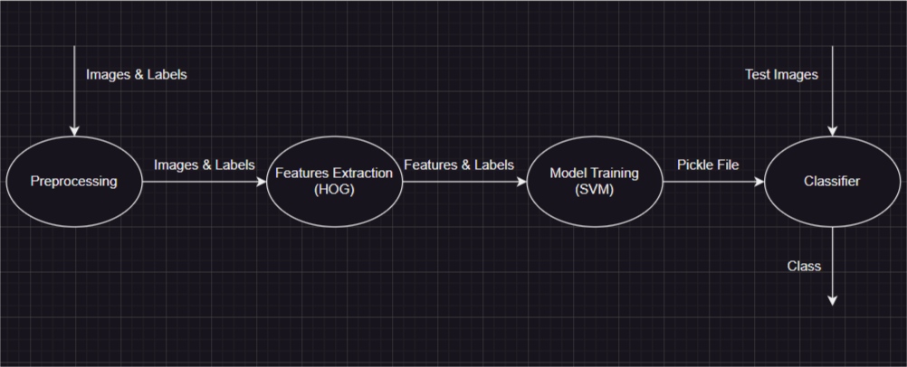

# Hand-Gesture-Recognition

## A machine learning basesd hand gesture classifier

<h2 style="display:inline">📝 Table of Contents</h2>

- [Built With](#built-with--)
- [Getting started](#getting-started)
- [Description](#description)
- [Project Pipeline](#project-pipeline)
- [Preprocessing Module](#preprocessing-module)
- [Features Extraction Module](#features-extraction-module)
- [Model Training Module](#model-training-module)
- [Performance Analysis and Results](#performance-analysis-and-results)
- [Enhancements and Future Work](#enhancements-and-future-work)

<h2 href="#BuiltWith">Built With </h2>
 <ul>
  <li><a href="https://www.python.org/">Python</a></li>
  <li><a href="https://pypi.org/project/opencv-python/">CV2</a></li>
  <li><a href="https://docs.python.org/3/library/pickle.html">Pickle</a></li>
   <li><a href="https://docs.python.org/3/library/argparse.html">argparse</a></li>
  <li><a href="https://numpy.org/">NumPy</a></li>
  <li><a href="https://scikit-image.org/">Skimage</a></li>
  <li><a href="https://scikit-learn.org/">Skilearn</a></li>
  <li><a href="https://docs.python.org/3/library/os.html">OS Python Library</a></li>
  <li><a href="https://docs.python.org/3/library/time.html">Time Python Library</a></li>
 </ul>

<h2 href="#GettingStarted">Getting Started</h2>
<blockquote>
  
This is a list of needed steps to set up your project locally, to get a local copy up and running follow these instructions.
 

</blockquote>
<ol>
  <li><strong><em>Clone the repository</em></strong>
    

        <code>$ git clone https://github.com/Waer1/Hand-Gesture-Recognition</code>
    

  </li>
  <li><strong><em>Install Pip and Python</em></strong>
    

        <h4>Follow this article to install Pip and Python <a href="https://phoenixnap.com/kb/install-pip-windows">Install Pip and Python</a></h4>
    

  </li>
  <li><strong><em>Install dependencies</em></strong>
    

        <h4>Please refer to previous Built With list to install all needed libraries</h4>
    

  </li>
  <li><strong><em>Train the model</em></strong>
    

        <code>$ py .\FinalCode\main.py --feature 0  --model 0 </code>
         
        <strong><em>Note: You should put the images under a folder named <code>Dataset</code> under the main folder <code>Hand-Gesture-Recognition</code></em></strong>
    

  </li>
  
  <li><strong><em>Test the model and performance analysis</em></strong>
    

        <code>$ py .\FinalCode\app.py --feature 0 </code>
         
        <strong><em>Note: You should put the images under a folder named <code>data</code> under the main folder <code>Hand-Gesture-Recognition</code></em></strong>
    

  </li>

</ol>

<h2 href="#Description">Description</h2>

<blockquote style="font-size: 15px; font-weight: 500">
  

    Hand gesture recognition has become an important area of research due to its potential applications in various fields such as robotics, healthcare, and gaming. The ability to recognize and interpret hand gestures can enable machines to understand human intentions and interact with them more effectively. For instance, in healthcare, hand gesture recognition can be used to control medical equipment without the need for physical contact, reducing the risk of infection. In gaming, it can enhance the user experience by allowing players to control games using hand gestures instead of traditional controllers. Overall, hand gesture recognition has immense potential to revolutionize the way we interact with machines and improve our daily lives.
  

</blockquote>

<h2 href="#Pipeline">Project Pipeline</h2>

<blockquote style="font-size: 15px; font-weight: 500">
  

    You can also look at it at <code>./Documentation/Project Pipeline.drawio</code>
  

</blockquote>

<h2 href="#Preprocessing">Preprocessing Module</h2>

<blockquote style="font-size: 15px; font-weight: 500">
  

    Our main problem at this stage is the fingers shadows due to poor imaging conditions, so, we overcome over that by applying multiple steps for every input image:
    <ol>
      <li>
        <strong><em>Convert the input image to YCrCb color space.</em></strong>
      </li>
      <li>
        <strong><em>Get the segmented image using 'range_segmentation' method as follows:</em></strong>
        <ol>
          <li>
            Segment the image based on the lower and upper bounds of skin color defined in YCrCb color space.
          </li>
          <li>
            Apply morphological operations to remove noise.
          </li>
          <li>
            Find the contours in the binary segmented image, get the contour with the largest area.
          </li>
          <li>
            Create a blank image to draw and fill the contours.
          </li>
          <li>
            Draw the largest contour on the blank image and fill the contour with white color.
          </li>
          <li>
            Return the image with the largest contour drawn on it.
          </li>
        </ol>
      </li>
      <li>
        <strong><em>Apply thresholding on cr and cb components.</em></strong>
      </li>
      <li>
        <strong><em>Apply the following formula bitwise <code>(cr || cb) && range_segmented_image.</code></em></strong>
      </li>
      <li>
        <strong><em>Apply morphological operations to remove noise.</em></strong>
      </li>
      <li>
        <strong><em>Get the image with the largest contour area.</em></strong>
      </li>
      <li>
        <strong><em>Apply histogram equaliztion to make the image more clear.</em></strong>
      </li>
      <li>
        <strong><em>Cut the greyscale image around the largest contour.</em></strong>
      </li>
      <li>
        <strong><em>Resize the image to small size to reduce extracted features array length.</em></strong>
      </li>
    </ol>
  

</blockquote>

<h2 href="#Features-Extraction">Features Extraction Module</h2>

<blockquote style="font-size: 15px; font-weight: 500">
  

    We tried multiple algorithms: SURF, SIFT, LBP, and HOG. And we selected HOG (Histogram of Oriented Gradients) for providing high accuracy.
     
     
    HOG algorithm is a computer vision technique used to extract features from images. It works by dividing an image into small cells and computing the gradient orientation and magnitude for each pixel within the cell. The gradient orientations are then binned into a histogram, which represents the distribution of edge orientations within that cell.
     
     
    The HOG algorithm has high accuracy because it is able to capture important information about the edges and contours in an image. This information can be used to identify objects or patterns within the image, even if they have varying lighting conditions.
     
     
    We apply HOG algorithm using hog() from skimage.feature, and with making sure that all features vectors are with the same length by padding zeros.
  

</blockquote>

<h2 href="#Model-Training">Model Training Module</h2>

<blockquote style="font-size: 15px; font-weight: 500">
  

    We tried multiple algorithms: Random Forest, Naive Bayes, Decision Tree, and SVM. 
    And we selected SVM (Support Vector Machine) for providing high accuracy.
     
     
    SVM is a powerful and popular machine learning algorithm used for classification and regression analysis. It works by finding the best hyperplane or decision boundary that separates the data into different classes. The hyperplane is chosen such that it maximizes the margin between the two classes, which helps to improve the generalization ability of the model.
     
     
    SVM has several advantages that make it a good choice for classification tasks. Some of these advantages include:
    <ol>
      <li>
        Effective in high-dimensional spaces: SVM can effectively handle datasets with a large number of features or dimensions.
      </li>
      <li>
        Robust to outliers: SVM is less sensitive to outliers in the data compared to other algorithms.
      </li>
      <li>
        Versatile: SVM can be used with different types of kernels, such as linear and polynomial, which makes it versatile and applicable to different types of datasets.
      </li>
      <li>
        Memory efficient: SVM uses a subset of the training data called support vectors to build the model, which makes it memory efficient and scalable to large datasets.
      </li>
      <li>
        Good generalization performance: SVM aims to maximize the margin between the two classes, which helps to improve the generalization performance of the model.
      </li>
    </ol>
    Overall, SVM is a powerful and flexible algorithm that can be used for various classification tasks in machine learning.
     
     
    We apply SVM algorithm using SVC() from sklearn.svm with linear kernel, and %80 of dataset images for training, and %20 of dataset images for testing.
  

</blockquote>

<h2 href="#Performance-Analysis-and-Results">Performance Analysis and Results</h2>

<blockquote style="font-size: 15px; font-weight: 500">
  

    Our result is that the trained model have predicted 83% of images correctly.
     
     
    You can run with your data under <code> data </code> folder under the main folder <code>Hand-Gesture-Recognition</code> the script <code>./FinalCode/app.py</code> to see output label and time taken for processing every image by using this command:
     
    <code>$ py .\FinalCode\app.py --feature 0</code>
  

</blockquote>

<h2 href="#Enhancements-and-Future-Work">Enhancements and Future Work</h2>

<blockquote style="font-size: 15px; font-weight: 500">
  

    Although we have optained an accuracy of 83% on our dataset, we believe that our work would be improved using these points.
     
    <ol>
      <li>
        <strong><em>Larger dataset.</em></strong>
      </li>
      <li>
        <strong><em>Using Deep Neural Networks.</em></strong>
      </li>
      <li>
        <strong><em>Better imaging conditions.</em></strong>
      </li>
    </ol>
  

</blockquote>
